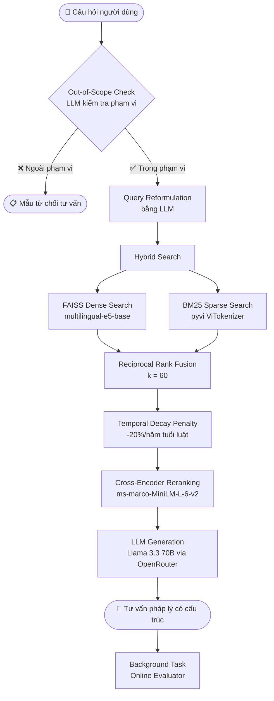
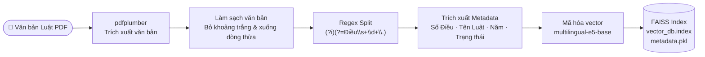
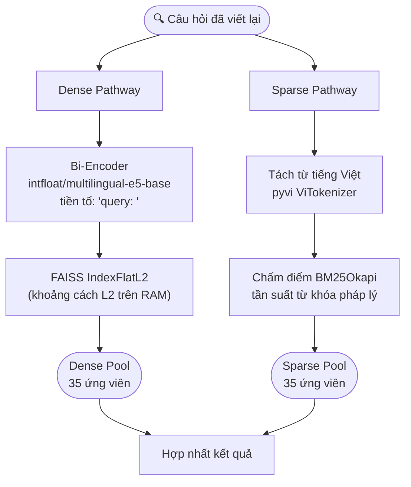
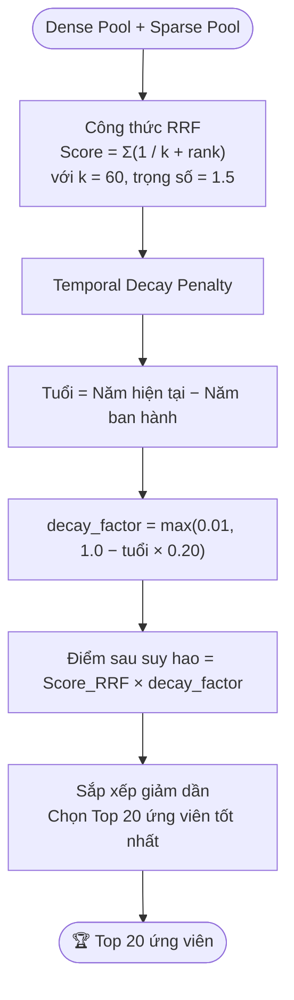
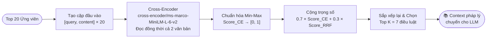
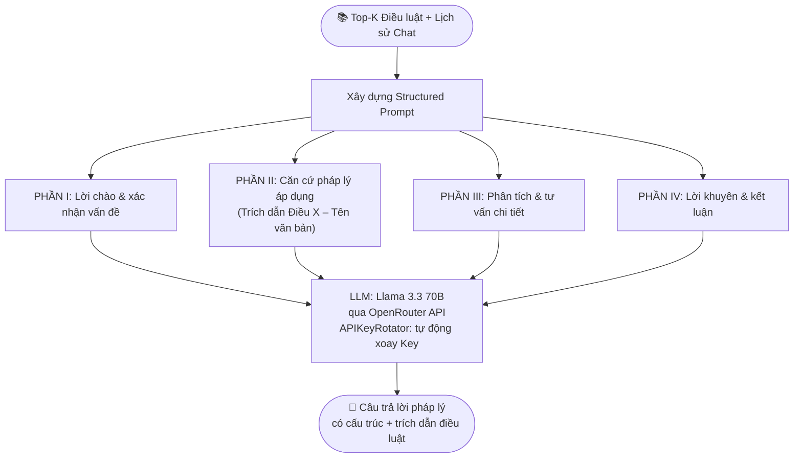
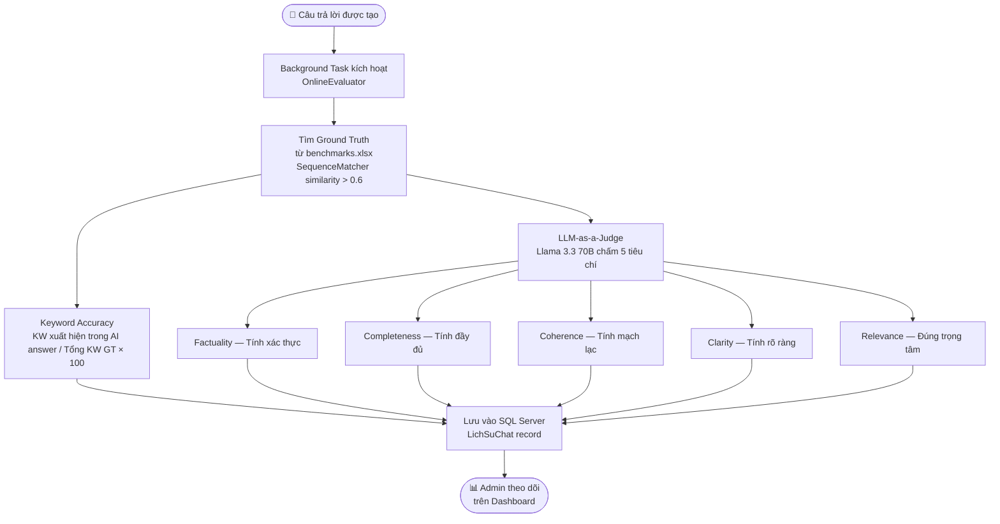
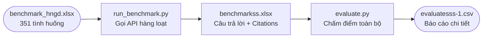

# ⚖️ RAG++ — Hệ thống Trợ giúp tra cứu thông tin Pháp lý  Luật Hôn nhân & Gia đình Việt Nam

<div align="center">


**Hệ thống RAG nâng cao (RAG++) chuyên biệt cho lĩnh vực pháp lý Việt Nam**  
*Tích hợp Hybrid Search · Temporal Decay · Cross-Encoder Reranking · LLM-as-a-Judge*

</div>

---

## 📋 Mục lục

- [Giới thiệu](#-giới-thiệu)
- [Tính năng nổi bật](#-tính-năng-nổi-bật)
- [Kiến trúc hệ thống](#-kiến-trúc-hệ-thống)
- [Pipeline RAG++](#-pipeline-rag-retrieval-augmented-generation-nâng-cao)
- [Pipeline Đánh giá](#-pipeline-đánh-giá-chất-lượng)
- [Cấu trúc thư mục](#-cấu-trúc-thư-mục)
- [Cài đặt & Chạy hệ thống](#️-cài-đặt--chạy-hệ-thống)
- [Hướng dẫn Đánh giá](#-hướng-dẫn-chạy-các-module-đánh-giá)
- [Kết quả thực nghiệm](#-kết-quả-thực-nghiệm)
- [Tài liệu tham khảo](#-tài-liệu-tham-khảo)
- [Thông tin tác giả](#-thông-tin-tác-giả)

---

## 📝 Giới thiệu

**LexRAG++** là hệ thống hỏi đáp pháp lý tự động được thiết kế nhằm giải quyết các thách thức cốt lõi của RAG cơ bản trong lĩnh vực pháp luật:

| Hạn chế của RAG cơ bản | Giải pháp LexRAG++ |
|---|---|
| 🔴 Ảo giác (Hallucination) | ✅ Prompt có cấu trúc nghiêm ngặt + Căn cứ điều luật bắt buộc |
| 🔴 Bỏ sót văn bản pháp lý mới | ✅ Temporal Decay Penalty — ưu tiên luật mới hơn |
| 🔴 Tìm kiếm chỉ theo ngữ nghĩa | ✅ Hybrid Search (Dense + Sparse) + Cross-Encoder Reranking |
| 🔴 Không có kiểm soát chất lượng | ✅ Online Evaluator + Human-in-the-loop (Admin Approval) |

### ⚖️ Phạm vi Tri thức Pháp lý

Hệ thống được nạp dữ liệu tri thức pháp lý chính thống bao gồm:

- **Luật Hôn nhân và Gia đình Việt Nam 2014** (Luật số 52/2014/QH13)
- **Nghị định 126/2014/NĐ-CP** — Quy định chi tiết một số điều và biện pháp thi hành
- **Nghị định 123/2015/NĐ-CP** — Hướng dẫn về đăng ký hộ tịch
- **Nghị định 10/2015/NĐ-CP** — Sinh con bằng kỹ thuật hỗ trợ sinh sản
- **Nghị định 82/2020/NĐ-CP** — Xử phạt vi phạm hành chính trong lĩnh vực HNGĐ
- **Thông tư liên tịch 01/2016/TTLT** — Hướng dẫn thực hiện một số quy định
- **Nghị quyết 01/2024/NQ-HĐTP** — Hướng dẫn áp dụng pháp luật trong xét xử

---

## ✨ Tính năng nổi bật

### 💬 Giao diện Chat Thông minh
- Hội thoại **đa lượt (Multi-turn)** có nhớ lịch sử ngữ cảnh
- Hiển thị chính xác các **điều luật được trích dẫn** (Citations) trong câu trả lời
- Kiểm tra phạm vi truy vấn (**Out-of-Scope Detection**) để từ chối câu hỏi ngoài phạm vi

### 🔍 Cơ chế Truy xuất Nâng cao
- **Hybrid Search**: Kết hợp FAISS Dense Search + BM25 Sparse Search
- **Temporal Decay**: Ưu tiên văn bản pháp luật mới hơn (phạt 20%/năm tuổi)
- **Cross-Encoder Reranking**: Tái xếp hạng kết quả với mô hình ms-marco-MiniLM-L-6-v2

### 📊 Đánh giá Chất lượng Tự động
- **Online Evaluation**: Tự động chạy nền sau mỗi câu trả lời
  - Keyword Accuracy (Độ trùng khớp từ khóa với Ground Truth)
  - LLM-as-a-Judge (5 tiêu chí học thuật, thang điểm 10)
- **Offline Benchmark**: Chạy hàng loạt trên 351 tình huống pháp lý

### 👨‍💼 Quản trị & Human-in-the-Loop
- **Admin Dashboard**: Duyệt, chỉnh sửa câu trả lời và cập nhật Ground Truth
- **Trang Phân tích**: Biểu đồ trực quan hóa chỉ số chất lượng theo thời gian
- **Xác thực OTP Email**: Đặt lại mật khẩu an toàn qua email

---

## 🏗️ Kiến trúc Hệ thống

```
┌─────────────────────────────────────────────────────────────────┐
│                        FRONTEND (Vanilla JS)                    │
│  chat.html │ admin.html │ phantich.html │ qlytuvan.html │ ...   │
└───────────────────────────┬─────────────────────────────────────┘
                            │ REST API (HTTP/JSON)
┌───────────────────────────▼─────────────────────────────────────┐
│                  BACKEND (FastAPI + Python)                      │
│                                                                  │
│  ┌──────────────┐  ┌──────────────┐  ┌───────────────────────┐  │
│  │ processor.py │  │ retrieval.py │  │    generation.py      │  │
│  │ (LLM Filter) │  │ (RAG Engine) │  │  (LLM + Key Rotator)  │  │
│  └──────────────┘  └──────────────┘  └───────────────────────┘  │
│                                                                  │
│  ┌──────────────────────────────────────────────────────────┐   │
│  │            online_evaluator.py (Background Task)         │   │
│  │        Keyword Accuracy + LLM-as-a-Judge (5 tiêu chí)   │   │
│  └──────────────────────────────────────────────────────────┘   │
└──────────┬─────────────────────────────────┬────────────────────┘
           │                                 │
┌──────────▼──────────┐         ┌────────────▼────────────┐
│   FAISS Vector DB   │         │  SQL Server (SQLAlchemy) │
│  vector_db.index    │         │  NguoiDung, LichSuChat   │
│  metadata.pkl       │         │  PhienChat, DanhGia...   │
└─────────────────────┘         └─────────────────────────┘
```

**Stack Kỹ thuật:**

| Thành phần | Công nghệ |
|---|---|
| Backend API | FastAPI 0.109.0 + Uvicorn |
| Frontend | Vanilla HTML5 / CSS3 / JavaScript |
| Vector DB | FAISS (IndexFlatL2) |
| Bi-Encoder | `intfloat/multilingual-e5-base` (768 chiều) |
| Cross-Encoder | `cross-encoder/ms-marco-MiniLM-L-6-v2` |
| Sparse Search | BM25Okapi + `pyvi` ViTokenizer |
| LLM Generator | Llama 3.3 70B (qua OpenRouter API) |
| Database | Microsoft SQL Server + SQLAlchemy ORM |
| Bảo mật | bcrypt (mật khẩu) + PyJWT (xác thực) |

---

## 🧬 Pipeline RAG++ (Retrieval-Augmented Generation Nâng cao)

### 🗺️ Tổng quan Pipeline



---

### Giai đoạn 0: Tiền xử lý & Chunking dữ liệu Luật



**Mô tả:**
> Các file PDF văn bản pháp luật được trích xuất bằng thư viện `pdfplumber`. Hệ thống chuẩn hóa văn bản, sau đó dùng biểu thức chính quy `(?i)(?=Điều\s+\d+\.)` để cắt theo từng **Điều luật** (Article-level chunking) — đảm bảo toàn vẹn ngữ nghĩa thay vì cắt theo độ dài ký tự. Mỗi đoạn văn được gắn metadata: số hiệu điều, tên luật, năm ban hành, trạng thái hiệu lực, rồi được mã hóa thành vector 768 chiều và lưu vào FAISS index.

---

### Giai đoạn 1: Tìm kiếm lai (Hybrid Search)



**Mô tả:**
> Câu hỏi sau khi viết lại được xử lý song song qua hai nhánh:
> - **Dense Pathway**: Bi-Encoder `multilingual-e5-base` mã hóa câu hỏi (thêm tiền tố `query: `) thành vector 768 chiều. FAISS tìm kiếm khoảng cách L2 trên toàn bộ kho vector, trả về 35 ứng viên có ngữ nghĩa gần nhất.
> - **Sparse Pathway**: Câu hỏi được tách từ bằng `ViTokenizer` rồi đưa qua `BM25Okapi` để chấm điểm tần suất từ khóa pháp lý, trả về 35 ứng viên khớp từ khóa tốt nhất.

---

### Giai đoạn 2: Reciprocal Rank Fusion & Temporal Decay



**Mô tả:**
> - **Hợp nhất RRF**: Áp dụng Reciprocal Rank Fusion với $k=60$ để chuẩn hóa điểm từ hai nguồn Dense và Sparse, cân bằng trọng số đóng góp ở mức $1.5$ cho mỗi nhánh.
> - **Temporal Decay Penalty**: Mỗi năm tuổi của văn bản pháp lý bị phạt suy hao **20%** điểm RRF (`decay_factor = 1.0 − tuổi × 0.20`), giới hạn tối thiểu `0.01`. Cơ chế này tự động nâng điểm văn bản mới ban hành và hạ điểm văn bản cũ đã hết hiệu lực.

---

### Giai đoạn 3: Cross-Encoder Reranking



**Mô tả:**
> Mô hình Cross-Encoder `ms-marco-MiniLM-L-6-v2` nhận đầu vào là các cặp `[Câu hỏi, Nội dung điều luật]` và chấm điểm mức độ liên quan trực tiếp (đọc song song cả hai văn bản thay vì độc lập như Bi-Encoder). Điểm từ Cross-Encoder và RRF được chuẩn hóa Min-Max rồi kết hợp theo công thức: **Final = 0.7 × Score_CE + 0.3 × Score_RRF**, ưu tiên 70% cho Cross-Encoder để đảm bảo độ chính xác ngữ cảnh. Hệ thống xuất ra $top\_k = 7$ điều luật tốt nhất.

---

### Giai đoạn 4: Sinh văn bản với Llama 3.3 70B



**Mô tả:**
> Ngữ cảnh gồm Top-K điều luật và lịch sử hội thoại được đưa vào **Llama 3.3 70B** (qua OpenRouter API) với cấu trúc prompt 4 phần nghiêm ngặt. Hệ thống tích hợp `APIKeyRotator` tự động phát hiện key hết hạn / bị lỗi và chuyển sang key dự phòng tiếp theo (hỗ trợ đến 50 key), đảm bảo uptime cao.

---

## 📊 Pipeline Đánh giá Chất lượng

### Online Evaluation (Tự động sau mỗi câu hỏi)



### Offline Benchmark (Đánh giá hàng loạt)



---

## 📂 Cấu trúc Thư mục

```
c:\KHOALUAN\
├── 📁 backend/
│   ├── 📁 app/
│   │   ├── 📁 db/
│   │   │   ├── database.py             # Cấu hình kết nối SQL Server (SQLAlchemy)
│   │   │   └── models.py               # Định nghĩa ORM: NguoiDung, LichSuChat, PhienChat...
│   │   ├── 📁 services/
│   │   │   ├── embedding.py            # Nhúng văn bản thành vector (Bi-Encoder)
│   │   │   ├── generation.py           # Tích hợp LLM Llama 3.3 70B + APIKeyRotator
│   │   │   ├── llm_service.py          # Module gọi Gemini (dự phòng)
│   │   │   ├── online_evaluator.py     # Đánh giá tự động nền (KW Acc + LLM Judge)
│   │   │   ├── processor.py            # Kiểm tra phạm vi & viết lại câu hỏi (LLM)
│   │   │   ├── retrieval.py            # Pipeline RAG++: FAISS + BM25 + RRF + CE
│   │   │   ├── security.py             # Mã hóa bcrypt + JWT Token
│   │   │   └── vector_store.py         # Quản lý FAISS Index
│   │   └── main.py                     # FastAPI: định nghĩa tất cả API Endpoints
│   ├── 📁 data/
│   │   ├── *.pdf                       # 10 file PDF văn bản pháp luật gốc
│   │   ├── metadata.pkl                # Metadata chunk: Điều, Tên luật, Năm, Trạng thái
│   │   └── vector_db.index             # FAISS Vector Index đã dựng sẵn
│   ├── 📁 scripts/
│   │   └── ingest_law.py               # Script tách luật theo Điều & nạp vào FAISS
│   ├── benchmarks.xlsx                 # Bộ dữ liệu chuẩn: Câu hỏi + Ground Truth
│   ├── benchmark_hngd.xlsx             # 351 tình huống pháp lý kiểm định
│   ├── evaluate.py                     # Script đánh giá offline (Keyword Acc + LLM Judge)
│   ├── run_benchmark.py                # Script chạy benchmark hàng loạt qua API
│   ├── .env                            # Biến môi trường: DB, JWT, API Keys
│   └── requirements.txt                # Danh sách thư viện Python
├── 📁 frontend/
│   ├── trangchu.html                   # Trang chủ giới thiệu hệ thống
│   ├── chat.html                       # Giao diện chat đa lượt chính
│   ├── admin.html                      # Dashboard quản trị & Human-in-the-loop
│   ├── phantich.html                   # Trang phân tích & biểu đồ chỉ số chất lượng
│   ├── qlytuvan.html                   # Quản lý lịch sử tư vấn
│   ├── qlytuvan_chitiet.html           # Chi tiết từng phiên tư vấn
│   ├── dangky.html                     # Đăng ký tài khoản
│   ├── login.html                      # Đăng nhập
│   ├── quenmatkhau.html                # Đặt lại mật khẩu (OTP Email)
│   ├── caidat.html                     # Cài đặt hồ sơ người dùng
│   ├── timhiuthem.html                 # Trang tìm hiểu thêm về hệ thống
│   └── app.js                          # Logic Frontend: gọi REST API, render giao diện
└── 📁 Word/                            # Tài liệu báo cáo nghiên cứu (NCKH, Khóa luận)
```

---

## ⚡ Cài đặt & Chạy Hệ thống

### Yêu cầu hệ thống

| Thành phần | Yêu cầu tối thiểu |
|---|---|
| Hệ điều hành | Windows 10/11 |
| Python | 3.9 trở lên |
| RAM | 8 GB (khuyến nghị 16 GB) |
| Database | Microsoft SQL Server / SQL Server Express |
| ODBC Driver | Microsoft ODBC Driver 17 for SQL Server |

### Bước 1: Thiết lập biến môi trường

Tạo file `.env` trong thư mục `backend/`:

```env
# ── Database Configuration ─────────────────────────────────
DB_SERVER=NGUYEN_HO\SQLEXPRESS
DB_NAME=ChatbotLuatHonNhan
DB_USER=sa
DB_PASS=123456

# ── Bảo mật JWT ─────────────────────────────────────────────
JWT_SECRET_KEY=your_strong_secret_key_here

# ── OpenRouter API Keys (Hệ thống tự động xoay vòng) ────────
OPENROUTER_API_KEY_1=sk-or-v1-your-key-1
OPENROUTER_API_KEY_2=sk-or-v1-your-key-2
# Có thể mở rộng đến OPENROUTER_API_KEY_50
```

### Bước 2: Cài đặt thư viện

```powershell
cd c:\KHOALUAN\backend
pip install -r requirements.txt
```

### Bước 3: Nạp dữ liệu luật (Ingestion)

Đặt các file PDF văn bản pháp luật vào `backend/data/`, sau đó chạy:

```powershell
python scripts/ingest_law.py
```

> Script sẽ tách văn bản theo từng Điều luật, trích xuất metadata, mã hóa vector và lưu vào `data/vector_db.index` + `data/metadata.pkl`.

### Bước 4: Khởi động Backend Server

```powershell
uvicorn app.main:app --reload --port 8000
```

### Bước 5: Truy cập giao diện

Mở trình duyệt và điều hướng đến thư mục `frontend/`, mở file HTML tương ứng hoặc dùng **Live Server** trong VS Code:

| Trang | File | Mô tả |
|---|---|---|
| Trang chủ | `trangchu.html` | Giới thiệu hệ thống |
| Chat | `chat.html` | Giao diện tư vấn chính |
| Admin | `admin.html` | Duyệt & quản lý câu trả lời |
| Phân tích | `phantich.html` | Biểu đồ chỉ số đánh giá |

**Tài khoản chạy thử:**
- 👤 Người dùng: `user01` / `123456`
- 🔑 Quản trị viên: `admin` / `admin123`

---

## 🔬 Hướng dẫn Chạy các Module Đánh giá

### 1. Đánh giá tự động trực tuyến (Online Evaluation)

> Được kích hoạt **tự động** sau mỗi câu hỏi — không cần thao tác thủ công.

Mỗi khi người dùng gửi câu hỏi qua giao diện, FastAPI kích hoạt một **Background Task** gọi `OnlineEvaluator`. Module này:
1. Tìm câu hỏi tương đồng nhất trong `benchmarks.xlsx` (SequenceMatcher > 0.6)
2. Tính **Keyword Accuracy** — đo tỷ lệ từ khóa Ground Truth xuất hiện trong câu trả lời
3. Gọi **LLM-as-a-Judge** — Llama 3.3 70B chấm điểm 5 tiêu chí học thuật (thang 0–100)
4. Lưu toàn bộ điểm vào SQL Server để Admin theo dõi

### 2. Chạy Benchmark hàng loạt

```powershell
cd c:\KHOALUAN\backend
python run_benchmark.py
```

- **Đầu vào:** `benchmark_hngd.xlsx` — 351 tình huống pháp lý
- **Đầu ra:** `benchmarkss.xlsx` — toàn bộ câu trả lời, trích dẫn luật và ngữ cảnh

### 3. Đánh giá Offline chi tiết

```powershell
python evaluate.py
```

- Tính điểm trung bình 5 tiêu chí LLM Judge và Keyword Accuracy trên toàn bộ dataset
- Xuất báo cáo tóm tắt ra Terminal
- Lưu báo cáo chi tiết tại `evaluatesss-1.csv`

---

## 📊 Kết quả Thực nghiệm

> Được thực hiện trên bộ dữ liệu **351 tình huống pháp lý phức tạp** thuộc phạm vi Luật Hôn nhân và Gia đình Việt Nam.

### Kết quả LLM-as-a-Judge (Thang điểm 10)

| Tiêu chí | Điểm số | Mô tả |
|---|:---:|---|
| Tính xác thực (Factuality) | **8.30 / 10** | Lập luận dựa trên căn cứ điều luật chính xác |
| Tính đầy đủ (Completeness) | **7.66 / 10** | Bao phủ tốt các khía cạnh pháp lý |
| Tính mạch lạc (Coherence) | **8.18 / 10** | Cấu trúc tư vấn rõ ràng, lập luận chặt chẽ |
| Tính rõ ràng (Clarity) | **8.25 / 10** | Ngôn từ tường minh, dễ hiểu |
| Đúng trọng tâm (Relevance) | **8.69 / 10** | Phản hồi trực tiếp thắc mắc pháp lý |
| **Điểm trung bình** | **8.22 / 10** | ✅ Vượt ngưỡng yêu cầu học thuật (7.50) |

### Keyword Accuracy

| Chỉ số | Giá trị | Ngưỡng yêu cầu | Đánh giá |
|---|:---:|:---:|:---:|
| Keyword Accuracy | **0.93 / 1.0** | 0.70 | ✅ Vượt xa ngưỡng |

---

### So sánh các Baseline & Cấu hình Multi-turn

Bảng so sánh **Keyword Accuracy (Acc)** và **LLM Judge Score (LLM)** trên 351 tình huống, đánh giá qua các lượt hội thoại từ 1-turn đến 5-turn với 3 cấu hình:

- **Zero** — LLM không có ngữ cảnh truy xuất (Zero-shot)
- **Retriever** — Chỉ dùng văn bản luật thô
- **Reference (RAG++)** — Hệ thống LexRAG++ hoàn chỉnh

| Model | Type | 1-turn Acc | 1-turn LLM | 2-turn Acc | 2-turn LLM | 3-turn Acc | 3-turn LLM | 4-turn Acc | 4-turn LLM | 5-turn Acc | 5-turn LLM | ALL Acc | ALL LLM |
|:---|:---|:---:|:---:|:---:|:---:|:---:|:---:|:---:|:---:|:---:|:---:|:---:|:---:|
| **GLM-4-Flash** | Zero | 0.3431 | 6.11 | 0.3534 | 6.86 | 0.3738 | 6.87 | 0.3737 | 6.88 | 0.3726 | 6.82 | 0.3633 | 6.71 |
| | Retriever | 0.3403 | 5.92 | 0.3670 | 6.75 | 0.3783 | 6.78 | 0.3794 | 6.83 | 0.3820 | 6.77 | 0.3694 | 6.61 |
| | Reference | 0.5843 | 6.52 | 0.4776 | 7.06 | 0.4610 | 6.99 | 0.4451 | 6.93 | 0.4382 | 6.89 | 0.4812 | 6.88 |
| **GLM-4** | Zero | 0.3468 | 6.40 | 0.3462 | 7.08 | 0.3782 | 7.13 | 0.3809 | 7.15 | 0.3836 | 7.16 | 0.3671 | 6.98 |
| | Retriever | 0.3713 | 6.24 | 0.3726 | 6.87 | 0.3981 | 6.90 | 0.3934 | 6.92 | 0.3905 | 6.88 | 0.3851 | 6.76 |
| | Reference | **0.6151** | 6.76 | **0.5423** | 7.27 | **0.5208** | 7.30 | 0.4906 | 7.27 | 0.4862 | 7.25 | 0.5310 | 7.17 |
| **GPT-3.5-turbo** | Zero | 0.3016 | 6.10 | 0.3032 | 6.63 | 0.3173 | 6.54 | 0.3218 | 6.47 | 0.3335 | 6.49 | 0.3154 | 6.45 |
| | Retriever | 0.3217 | 5.88 | 0.3057 | 6.41 | 0.3220 | 6.38 | 0.3278 | 6.31 | 0.3231 | 6.30 | 0.3200 | 6.26 |
| | Reference | 0.5063 | 6.53 | 0.4055 | 6.90 | 0.3970 | 6.74 | 0.3862 | 6.63 | 0.3946 | 6.65 | 0.4179 | 6.69 |
| **GPT-4o-mini** | Zero | 0.2982 | 5.95 | 0.2962 | 6.48 | 0.3195 | 6.39 | 0.3075 | 6.28 | 0.3219 | 6.27 | 0.3086 | 6.28 |
| | Retriever | 0.3308 | 5.92 | 0.3395 | 6.51 | 0.3411 | 6.38 | 0.3445 | 6.32 | 0.3468 | 6.33 | 0.3405 | 6.29 |
| | Reference | 0.5249 | 6.39 | 0.4265 | 6.83 | 0.4063 | 6.62 | 0.3948 | 6.47 | 0.3953 | 6.48 | 0.4295 | 6.56 |
| **Qwen-2.5-72B** | Zero | 0.3583 | 6.83 | 0.4037 | 7.37 | 0.4260 | 7.32 | 0.4271 | 7.33 | 0.4266 | 7.33 | 0.4083 | 7.24 |
| | Retriever | 0.3723 | 6.46 | 0.4097 | 7.24 | 0.4296 | 7.23 | 0.4249 | 7.27 | 0.4359 | 7.28 | 0.4144 | 7.09 |
| | Reference | 0.6045 | **7.14** | 0.5260 | **7.45** | 0.5186 | **7.49** | **0.5117** | **7.41** | **0.5015** | **7.37** | **0.5324** | **7.37** |
| **Llama-3.3-70B** | Zero | 0.2556 | 4.98 | 0.2695 | 5.63 | 0.2846 | 5.46 | 0.2800 | 5.21 | 0.2894 | 5.22 | 0.2758 | 5.30 |
| | Retriever | 0.2735 | 5.26 | 0.2755 | 5.69 | 0.2861 | 5.47 | 0.2850 | 5.32 | 0.2884 | 5.18 | 0.2817 | 5.38 |
| | Reference | 0.5468 | 5.83 | 0.4583 | 6.30 | 0.4459 | 6.02 | 0.4423 | 5.85 | 0.4454 | 5.83 | 0.4677 | 5.97 |
| **Claude-3.5-sonnet** | Zero | 0.2464 | 5.60 | 0.2856 | 6.03 | 0.2989 | 5.95 | 0.3050 | 5.86 | 0.3064 | 5.91 | 0.2884 | 5.87 |
| | Retriever | 0.3667 | 6.42 | 0.3436 | 6.90 | 0.3554 | 6.88 | 0.3604 | 6.79 | 0.3597 | 6.77 | 0.3571 | 6.75 |
| | Reference | 0.5030 | 6.26 | 0.4304 | 6.60 | 0.4039 | 6.32 | 0.3786 | 6.12 | 0.3840 | 6.19 | 0.4199 | 6.30 |

> **Ghi chú:** Kết quả tốt nhất trong từng cột được in **đậm**. Cấu hình **Reference (RAG++)** nhất quán vượt trội so với Zero-shot và Retriever-only trên tất cả các mô hình và số lượt hội thoại.

---

## 📚 Tài liệu Tham khảo

1. Luật Hôn nhân và Gia đình Việt Nam số 52/2014/QH13.
2. Lewis, P., et al. (2020). *Retrieval-Augmented Generation for Knowledge-Intensive NLP Tasks*. NeurIPS 2020.
3. Robertson, S., & Zaragoza, H. (2009). *The Probabilistic Relevance Framework: BM25 and Beyond*. Foundations and Trends in Information Retrieval.
4. Wang, L., et al. (2022). *Text Embeddings by Weakly-Supervised Contrastive Pre-training*. (multilingual-e5-base).
5. Nogueira, R., & Cho, K. (2019). *Passage Re-ranking with BERT*. (ms-marco-MiniLM Cross-Encoder).
6. Llama 3.3 model documentation by Meta AI.
7. Zheng, L., et al. (2023). *Judging LLM-as-a-Judge with MT-Bench and Chatbot Arena*. NeurIPS 2023.

---

## 👤 Thông tin Tác giả

| Thông tin | Chi tiết |
|---|---|
| **Họ và tên** | Nguyễn Văn Hồ |
| **Mã số sinh viên** | 222520 |
| **Đề tài** | ỨNG DỤNG  CÔNG NGHỆ RAG++ XÂY DỰNG CHATBOT TRỢ GIÚP TRA CỨU THÔNG TIN PHÁP LÝ THÔNG MINH VỀ LUẬT HÔN NHÂN VÀ GIA ĐÌNH |
| **Trường** | Đại học Nam Cần Thơ |

---

<div align="center">

*© 2024 RAG++ — Dự án Khóa Luận Tốt nghiệp*

</div>
