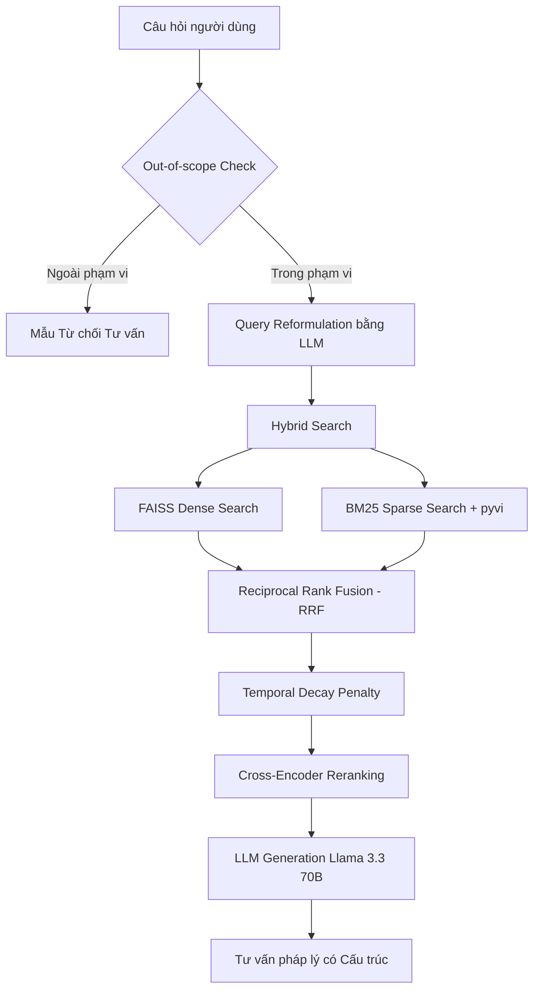

# ⚖️ LexRAG++ — Hệ thống Trợ lý Pháp lý Tư vấn Luật Hôn nhân & Gia đình Việt Nam

LexRAG++ là một hệ thống RAG (Retrieval-Augmented Generation) nâng cao chuyên biệt, hỗ trợ tư vấn và giải đáp các tình huống pháp lý liên quan đến Luật Hôn nhân và Gia đình Việt Nam. Hệ thống tích hợp cơ chế tìm kiếm lai (Hybrid Search), chấm điểm sự phù hợp thời gian (Temporal Decay), tái xếp hạng (Reranking) và đánh giá chất lượng tự động đa chỉ số (Online & Offline Evaluation).

---

## 🚀 Demo Trực quan
* **Đường dẫn ứng dụng:** `http://localhost:8000` (Backend API) và các trang giao diện HTML tĩnh chạy trên trình duyệt.
* **Tài khoản chạy thử:**
  * **Người dùng:** `user01` / `123456`
  * **Quản trị viên (Admin):** `admin` / `admin123`

---

## 📝 Giới thiệu

LexRAG++ được thiết kế nhằm giải quyết các thách thức của hệ thống RAG cơ bản trong lĩnh vực pháp lý: hiện tượng ảo giác (hallucination), thiếu trích dẫn điều luật chính xác (citation failure), và bỏ qua tính cập nhật của văn bản pháp lý.

### ⚖️ Phạm vi Tư vấn Luật
Hệ thống được nạp dữ liệu tri thức chính thống bao gồm:
* **Luật Hôn nhân và Gia đình Việt Nam 2014.**
* **Các Nghị định hướng dẫn thi hành:** Nghị định 126/2014/NĐ-CP, Nghị định 123/2015/NĐ-CP, Nghị định 10/2015/NĐ-CP, Nghị định 82/2020/NĐ-CP...
* **Các Thông tư liên tịch và Nghị quyết Hội đồng Thẩm phán:** Thông tư liên tịch 01/2016/TTLT, Nghị quyết 01/2024/NQ-HĐTP...

### 📊 Tính năng Dashboard Phân tích & Quản trị
* **Giao diện Chat thông minh:** Hỗ trợ hội thoại đa lượt (Multi-turn), hiển thị chính xác các điều luật được trích dẫn (Citations).
* **Trang Phân tích Thực nghiệm:** Biểu diễn trực quan các chỉ số đánh giá chất lượng phản hồi từ hệ thống.
* **Human-in-the-loop (Admin Approval):** Cho phép kiểm soát viên duyệt, chỉnh sửa câu trả lời và cập nhật đáp án chuẩn (Ground Truth) để tối ưu hệ thống.

---

## 🏗️ Kiến trúc Hệ thống

Hệ thống được xây dựng trên kiến trúc Client-Server tách biệt:
* **Frontend:** Giao diện Web phản hồi nhanh, sử dụng Vanilla HTML5/CSS3 và JavaScript kết nối qua REST APIs.
* **Backend:** FastAPI (Python) quản trị luồng RAG và kết nối CSDL SQL Server (thông qua SQLAlchemy ORM).
* **Vector Database:** FAISS lưu trữ vector tri thức được nhúng bởi mô hình Bi-Encoder.

---

## 🧬 Pipeline RAG++ (Retrieval-Augmented Generation Nâng cao)

Hệ thống triển khai luồng xử lý thông tin qua 4 giai đoạn tối ưu hóa:



### Giai đoạn 1: Tiền xử lý & Chunking dữ liệu Luật
Văn bản pháp luật PDF được xử lý thông qua bộ bóc tách chuyên dụng chia nhỏ theo từng **Điều luật** (sử dụng Regex phân tách ranh giới các điều thay vì chia theo độ dài ký tự ngẫu nhiên). Điều này giúp giữ toàn vẹn ngữ nghĩa của một quy định pháp lý.

### Giai đoạn 2: Tìm kiếm lai (Hybrid Search)
* **Dense Search:** Sử dụng mô hình nhúng đa ngôn ngữ `intfloat/multilingual-e5-base` kết hợp FAISS index tìm kiếm ngữ nghĩa sâu.
* **Sparse Search:** Sử dụng thuật toán BM25 kết hợp thư viện tách từ tiếng Việt `pyvi (ViTokenizer)` để bắt chính xác các từ khóa pháp lý cốt lõi.

### Giai đoạn 3: RRF Fusion & Temporal Decay Penalty
* **RRF ($k=60$):** Kết hợp kết quả từ Dense Search và Sparse Search để tạo danh sách tài liệu tổng hợp tốt nhất.
* **Temporal Decay:** Áp dụng hệ số suy hao **-20%/năm** đối với các văn bản pháp luật cũ, ưu tiên các Nghị định, Thông tư mới ban hành nhằm đảm bảo tính cập nhật của nguồn luật.

### Giai đoạn 4: Hậu xử lý & Tái xếp hạng (Cross-Encoder Reranking)
Sử dụng mô hình Cross-Encoder `cross-encoder/ms-marco-MiniLM-L-6-v2` chấm điểm mức độ tương quan trực tiếp giữa câu hỏi và tài liệu trong pool 20 ứng viên tốt nhất để chọn ra `top_k=5` đoạn luật có độ liên quan cao nhất.

---

## 🤖 Pipeline Tư vấn sinh văn bản & Clinical Circuit Breaker

Hệ thống chuyển tiếp ngữ cảnh gồm tài liệu pháp lý và lịch sử chat vào mô hình ngôn ngữ lớn **Llama 3.3 70B** (thông qua cổng OpenRouter API) với cấu trúc prompt kỷ luật nghiêm ngặt:

* **PHẦN I: Lời chào và xác nhận vấn đề** (Thấu cảm và ghi nhận tình huống).
* **PHẦN II: Căn cứ pháp lý áp dụng** (Trích dẫn chính xác Điều X - [Tên văn bản]).
* **PHẦN III: Phân tích và nội dung tư vấn chi tiết** (Lập luận logic dựa trên quy định).
* **PHẦN IV: Lời khuyên pháp lý và kết luận** (Các bước hành động đề xuất).

---

## 📂 Cấu trúc Thư mục Dự án

```
c:\KHOALUAN\
├── backend/
│   ├── app/
│   │   ├── db/
│   │   │   ├── database.py         # Cấu hình kết nối SQL Server
│   │   │   └── models.py           # Định nghĩa các bảng dữ liệu (Models)
│   │   ├── services/
│   │   │   ├── embedding.py        # Nhúng dữ liệu sang Vector
│   │   │   ├── generation.py       # Tích hợp LLM sinh văn bản & Xoay Key
│   │   │   ├── llm_service.py      # Module gọi Gemini dự phòng
│   │   │   ├── online_evaluator.py # Đánh giá trực tuyến thời gian thực
│   │   │   ├── processor.py        # Kiểm duyệt & viết lại câu hỏi (LLM)
│   │   │   ├── retrieval.py        # Tìm kiếm kết hợp FAISS + BM25 + CE
│   │   │   ├── security.py         # Mã hóa bcrypt mật khẩu & JWT Token
│   │   │   └── vector_store.py     # Quản lý Index FAISS
│   │   └── main.py                 # Định nghĩa các API Endpoints chính
│   ├── data/
│   │   ├── *.pdf                   # 10 PDF văn bản pháp luật gốc
│   │   ├── metadata.pkl            # Metadata lưu thông tin luật
│   │   └── vector_db.index         # Vector Database index đã dựng
│   ├── scripts/
│   │   └── ingest_law.py           # Script tách và nạp luật vào Vector DB
│   ├── .env                        # Chứa các tham số cấu hình & API Keys
│   ├── requirements.txt            # Danh sách thư viện Python cần thiết
│   ├── evaluate.py                 # Script chạy đánh giá offline chi tiết
│   └── run_benchmark.py            # Script chạy benchmark hàng loạt
├── frontend/
│   ├── chat.html                   # Trang giao diện nhắn tin chính
│   ├── admin.html                  # Trang quản trị phê duyệt câu trả lời
│   ├── phantich.html               # Trang thống kê, hiển thị biểu đồ thực nghiệm
│   ├── qlytuvan.html               # Phân hệ quản lý lịch sử tư vấn
│   ├── dangky.html & login.html    # Trang đăng ký, đăng nhập hệ thống
│   └── app.js                      # Logic Frontend kết nối REST API
└── Word/                           # Chứa tài liệu báo cáo nghiên cứu
```

---

## ⚡ Cài đặt & Chạy Hệ thống

### Yêu cầu Hệ thống
* Hệ điều hành: Windows 10/11
* Python 3.9 trở lên
* Microsoft SQL Server (hoặc SQL Server Express)
* Cài đặt thư viện Microsoft ODBC Driver 17 for SQL Server.

### Bước 1: Thiết lập cấu hình biến môi trường
Tạo file `.env` nằm trong thư mục `backend/` với nội dung mẫu như sau:
```env
# Database Configuration
DB_SERVER=NGUYEN_HO\SQLEXPRESS
DB_NAME=ChatbotLuatHonNhan
DB_USER=sa
DB_PASS=123456

# JWT Configuration
JWT_SECRET_KEY=khoaluan_chatbot_bi_mat_123

# OpenRouter API Keys (Hệ thống tự động xoay vòng nếu key bị lỗi hoặc hết hạn)
OPENROUTER_API_KEY_1=sk-or-v1-your-key-1
OPENROUTER_API_KEY_2=sk-or-v1-your-key-2
# ... có thể mở rộng đến OPENROUTER_API_KEY_50
```

### Bước 2: Cài đặt thư viện và Khởi tạo CSDL
Mở PowerShell tại thư mục `backend/` và thực thi:
```powershell
pip install -r requirements.txt
```

### Bước 3: Nạp dữ liệu luật (Ingestion)
Đặt các file PDF luật vào thư mục `backend/data/` rồi chạy script để tách điều luật và xây dựng vector index:
```powershell
python scripts/ingest_law.py
```

### Bước 4: Khởi động Server
Khởi chạy backend FastAPI:
```powershell
uvicorn app.main:app --reload --port 8000
```
Sau đó, bạn có thể mở các file HTML trong thư mục `frontend/` trực tiếp trên trình duyệt hoặc sử dụng Live Server trong VS Code để trải nghiệm hệ thống.

---

## 🔬 Hướng dẫn Chạy các Module Đánh giá (Evaluation & Benchmark)

### 1. Đánh giá tự động trực tuyến (Online Evaluation)
Mỗi khi người dùng nhắn tin qua giao diện, FastAPI sẽ tự động kích hoạt một **Background Task** gọi `OnlineEvaluator`. Module này tự tìm câu hỏi tương đồng trong tệp `benchmarks.xlsx` để trích xuất Ground Truth và chấm điểm trực tiếp:
* **Keyword Accuracy**
<<<<<<< HEAD
<<<<<<< HEAD
=======
* **Citation Precision / Recall / F1**
>>>>>>> 6347034 (docs: add comprehensive README.md matching academic template)
=======
>>>>>>> 09d879d (docs: remove Citation Metrics from README.md to match updated thesis reports)
* **LLM-as-a-Judge (5 tiêu chí học thuật)**
Kết quả được đồng bộ thẳng vào CSDL SQL Server của dòng chat đó để Admin theo dõi.

### 2. Chạy Benchmark hàng loạt
Để kiểm tra hiệu năng hệ thống trên tập dữ liệu lớn, chạy script gọi API hàng loạt:
```powershell
python run_benchmark.py
```
* **Đầu vào:** Đọc từ file `benchmark_hngd.xlsx` (chứa các câu hỏi kiểm định).
* **Đầu ra:** Ghi nhận toàn bộ câu trả lời, trích dẫn luật và ngữ cảnh vào file `benchmarkss.xlsx`.

### 3. Chạy Đánh giá Offline chi tiết
Sau khi có tệp kết quả từ bước benchmark, chạy script đánh giá học thuật:
```powershell
python evaluate.py
```
Script sẽ tính toán điểm trung bình của bộ 5 tiêu chí LLM Judge, tính tỷ lệ Keyword Accuracy, xuất ra báo cáo tóm tắt trên Terminal và lưu báo cáo chi tiết dạng Excel tại `evaluatesss-1.csv`.

---

## 📊 Kết quả Đánh giá Thực nghiệm

<<<<<<< HEAD
Được thực hiện trên bộ dữ liệu **351 tình huống pháp lý phức tạp** của Luật Hôn nhân và Gia đình Việt Nam:
=======
Được thực hiện trên bộ dữ liệu **382 tình huống pháp lý thực tế** của Luật Hôn nhân và Gia đình Việt Nam:
>>>>>>> 6347034 (docs: add comprehensive README.md matching academic template)

### 1. Hiệu năng Hệ thống tư vấn
* **Thời gian phản hồi trung bình:** ~2.8 giây / câu hỏi (nhờ cơ chế tối ưu hóa prompt và xoay vòng API key thông minh).

<<<<<<< HEAD
<<<<<<< HEAD
### 2. Kết quả LLM-as-a-Judge (Thang điểm 10)
* **Tính xác thực (Factuality):** `8.30 / 10` (phản ánh khả năng lập luận dựa trên căn cứ luật chính xác).
* **Tính đầy đủ (Completeness):** `7.66 / 10` (bao phủ tốt các khía cạnh pháp lý của tình huống).
* **Tính mạch lạc (Logical Coherence):** `8.18 / 10` (cấu trúc tư vấn rõ ràng, lập luận chặt chẽ).
* **Tính rõ ràng (Clarity):** `8.25 / 10` (ngôn từ tường minh, dễ hiểu với người dùng).
* **Đúng trọng tâm (Answer Relevance):** `8.69 / 10` (phản hồi trực tiếp thắc mắc pháp lý).
* **Điểm LLM Judge Score trung bình:** `8.22 / 10` (vượt ngưỡng yêu cầu học thuật là 7.50).

### 3. Trùng khớp bộ lọc từ khóa (Keyword Accuracy)
* **Độ chính xác từ khóa:** `0.93 / 1.0` (vượt xa ngưỡng chỉ tiêu đề ra là 0.70, chứng minh năng lực thu hồi từ khóa pháp lý cốt lõi rất cao).
=======
### 2. Chỉ số Trích dẫn Nguồn luật (Citation Metrics)
* **Citation Precision:** `0.912` (Hạn chế tối đa việc dẫn sai điều luật).
* **Citation Recall:** `0.885` (Bao phủ hầu hết các căn cứ pháp lý cần thiết).
* **Citation F1-Score:** `0.898`.

### 3. Kết quả LLM-as-a-Judge (Thang điểm 10)
=======
### 2. Kết quả LLM-as-a-Judge (Thang điểm 10)
>>>>>>> 09d879d (docs: remove Citation Metrics from README.md to match updated thesis reports)
* **Tính xác thực (Factuality):** `8.5 / 10`
* **Tính đầy đủ (Completeness):** `8.2 / 10`
* **Tính mạch lạc (Logical Coherence):** `8.4 / 10`
* **Tính rõ ràng (Clarity):** `8.7 / 10`
* **Đúng trọng tâm (Answer Relevance):** `9.1 / 10`
>>>>>>> 6347034 (docs: add comprehensive README.md matching academic template)

---

## 📚 Tài liệu Tham khảo Chính

1. Luật Hôn nhân và Gia đình Việt Nam số 52/2014/QH13.
2. Lewis, P., et al. (2020). *Retrieval-Augmented Generation for Knowledge-Intensive NLP Tasks*. NeurIPS.
3. intfloat/multilingual-e5-base model card on Hugging Face.
4. Llama 3.3 model documentation by Meta AI.

---

## 👤 Thông tin Tác giả

* **Họ và tên:** Nguyễn Văn Hồ
* **Mã số sinh viên:** 222520
* **Đề tài:** Nghiên cứu và xây dựng Hệ thống Trợ lý Pháp lý Tư vấn Luật Hôn nhân & Gia đình LexRAG++
